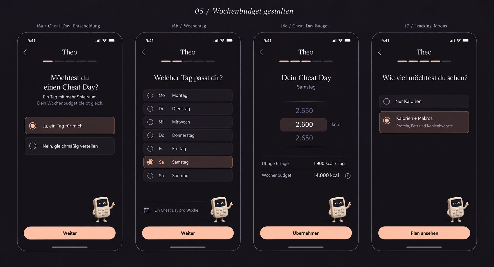

# Theo — Charakter, Design und Verhalten

Stand: 20. September 2026. Diese Seite bündelt die bisherigen Absprachen zum App-Maskottchen. Sie unterscheidet festgelegtes Verhalten, visuelle Referenz, vorläufigen Code und noch offene Ausarbeitung. Die schriftlichen Anforderungen haben bei Abweichungen Vorrang vor Beispielbildern.

## Name und Aufgabe

- Schreibweise **Theo**, mit großem T; auch im Logo. Der Name steht für **Theory**.
- Theo ist ein kleiner **Taschenrechner-Charakter**, der die App begleitet und ihre Berechnungen verständlich macht.
- Er erklärt auf Wunsch, was ein Screen abfragt, warum eine Angabe benötigt wird und wie sie den Plan beeinflusst. Vertiefende Rechenschritte bleiben optional erreichbar.
- Der Name ist auf dem ersten Screen sinnvoll. Auf weiteren Screens muss weder im Header noch neben der Figur ständig „Theo“ stehen.
- Die Hilfe in V1 benötigt kein LLM. Die spätere Voice-Funktion ist eine eigene Ausbaustufe.

## Aussehen und Designrichtung

Gewählt wurde **04 · Nocturne**: dunkles Pflaumengrau/Anthrazit, dezente Pfirsichakzente, ruhige Typografie und viel freie Fläche. Theo soll sich in diese zurückhaltende Gestaltung einfügen. Zahlen, Eingaben und Hauptaktionen behalten Vorrang.

Die vorhandene Bildreferenz zeigt einen hellen, abgerundeten Taschenrechner mit dunklem Gesichtsdisplay, kleinen Tasten, Armen und Beinen. Diese Merkmale beschreiben die bestehende Referenz; ein endgültiges, animierbares Produktionsasset und dessen genaue Proportionen sind noch nicht freigegeben. Der aktuelle Code-Entwurf ersetzt diese Freigabe nicht.

## Beispielbild aus der gemeinsamen Designrunde

Bilddatei: [theo-nocturne-onboarding-reference.png](../assets/ui/theo-nocturne-onboarding-reference.png). Das bereits im Repo gespeicherte Bild wird unverändert eingebunden; es ist keine neue Designfreigabe.

**Einordnung des Bildes:**

- Es veranschaulicht Figur, Farbwelt und die ruhige Gestaltung. Die dritte Ansicht zeigt das Cheat-Day-Budget.
- Die Position **unten rechts oberhalb des Weiter-Buttons wurde abgelehnt**. Sie darf aus dem Bild nicht als Vorgabe übernommen werden.
- Die wiederholte Überschrift „Theo“ auf jedem Screen ist nicht erforderlich.
- Die Einführungssprechblase fehlt im Bild, gehört aber zum festgelegten Verhalten.
- Frisuren und die beschriebenen Animationen sind hier nicht dargestellt.
- Das gezeigte Wochenbudget gehört zur Onboarding-Erklärung. Es begründet keine Wochenübersicht auf dem Main Screen. Zahlen im Bild sind illustrative Designwerte.

## Platzierung

Die frühere Position des Theo-Taschenrechners im Onboarding gefällt dem Nutzer nicht. Eine endgültige Alternative ist **noch offen**. Auch eine Position oben rechts ist keine bestätigte Designentscheidung; die aktuelle Implementierung verwendet sie nur vorläufig.

Bei der weiteren Ausarbeitung darf Theo weder Eingabefelder, Zahlen, Tastaturbedienung noch primäre Buttons verdecken. Seine Animationen verändern das übrige Layout nicht. Die Position muss auf iOS, Android und Web geprüft werden.

## Sprechblasen und antippbare Hilfe

1. Beim **allerersten Auftreten** zeigt Theo eine kurze Sprechblase: Man kann ihn antippen, um Informationen zu bekommen.
2. Danach bleiben Sprechblasen standardmäßig verborgen. Kein erneutes automatisches Aufklappen bei jedem Screenwechsel und keine dauerhaft sichtbaren Erklärungen.
3. Antippen öffnet Hilfe zum aktuellen Kontext. Ein ausführlicher Rechenweg kann bei Bedarf aufgerufen werden.

Bisheriger Textvorschlag für die Einführung:

> Tippe auf mich – ich erkläre dir diese Eingabe und wie sie deinen Plan beeinflusst.

Der Wortlaut ist ein Vorschlag, keine endgültige Copy-Freigabe. Genauer erster Einsatzort, Schließen-Verhalten und dauerhafte Speicherung des Einführungshinweises sind noch auszuarbeiten. Im ersten Entwicklungsstand wird der Hinweis lokal als gesehen gespeichert.

## Frisur bei der Geschlechtsauswahl — nur dort

- Beim Auswählen von **männlich** oder **weiblich** bekommt Theo die dazu vorgesehene Frisur.
- Dieses Verhalten gilt **ausschließlich auf dem einen Screen zur Geschlechts-/Berechnungskategorie**.
- Beim Verlassen dieses Screens erscheint Theo wieder ohne diese temporäre Frisur — auch bei Zurücknavigation und anderen Navigationswegen.
- Beim erneuten Öffnen darf auf diesem Screen die zur bestehenden Auswahl passende Frisur wieder erscheinen.
- Es handelt sich um eine exklusive Auswahl: Eine der beiden Kategorien ist aktiv, nicht zwei unabhängig aktivierbare Checkboxen.
- Die konkrete Gestaltung der beiden Frisuren ist noch offen. Daraus folgt keine dauerhafte Änderung von Theos Identität, Gesicht oder Körper.

## Animationen und Reaktionen

Theo reagiert kurz auf eine Eingabe oder bewusste Aktion und kommt anschließend zur Ruhe. Keine dauerhaften Idle- oder Trainingsschleifen. Die folgenden Ideen wurden festgehalten; ihre Aufnahme bedeutet nicht, dass sie alle bereits implementiert sind.

| Kontext | Vereinbartes bzw. geplantes Verhalten | Grenze |
| --- | --- | --- |
| Körpergröße | Theo wächst oder schrumpft animiert entsprechend der eingegebenen Größe. Skalierung begrenzen; Füße bleiben am selben Ort, Layout bleibt unverändert. Die zum Wert passende Größe bleibt nach der Eingabe bestehen. | Betrifft den Größen-Screen; keine Übertragung der Körpergröße auf sämtliche späteren Screens vereinbart. |
| Geschlechtsauswahl | Zur Auswahl passende Frisur anzeigen. | Nur auf diesem Screen; konkrete Übergangsanimation noch offen. |
| Schritte | Auf der Stelle gehen, bei höheren Schrittzahlen etwas flotter. | Stoppt nach der Eingabe. |
| Trainingshäufigkeit | Kurze kleine Übungen; dezente Punkte zeigen die Anzahl der Einheiten. | Keine dauerhafte Trainingsschleife. |
| Trainingsdauer | Kleinen Timer aufdrehen; ein Bogen wächst oder schrumpft mit der Dauer. | Danach bleibt der Zustand ruhig. |
| Zielzeitraum | Kleinen Kalender auseinanderziehen oder zusammenschieben. | Mehr Zeit wird sichtbar; danach Stillstand. |
| Cheat-Day-Budget | Elemente zwischen sechs regulären Stapeln und einem Cheat-Day-Stapel umverteilen. | Gesamtmenge bleibt gleich; vorzugsweise in bewusst geöffneter Hilfe. Keine permanente Wochenübersicht. |
| Berechnung öffnen | Nacheinander auf die sichtbaren Rechenschritte zeigen. | Schritte bleiben lesbar, anschließend Ruhe. |
| Plan speichern | Kurz ein Häkchen auf dem Display anzeigen. | Erst nach bestätigtem Speichererfolg, niemals nur nach Antippen des Buttons. |
| Gewicht eingeben | Eine kleine Waage neutral ablesen. | Keine Veränderung zu „dicker/dünner“, keine wertende Freude oder Trauer. |
| Spracheingabe, spätere Version | Kleine Wellenform auf dem Display reagiert auf die Stimme. | Nur während echter Aufnahme; endet beim Stoppen/Abbrechen. Keine Aufnahme und kein Voice-Tracking in V1. |

Als erste Kandidaten wurden Größe, Schritte und Cheat-Day-Umverteilung vorgeschlagen. Exakte Dauern, Skalierungsgrenzen, Bewegungsstärken, Requisiten und Übergänge sind noch auszuarbeiten.

## Bewegungsregeln und Zugänglichkeit

- Systempräferenz **„Bewegung reduzieren“** respektieren. Alle Informationen und Funktionen bleiben auch ohne Animation verständlich und bedienbar.
- Bei schnellen Eingabewechseln dem aktuellen Wert folgen; keine Warteschlange veralteter Animationen abspielen.
- Beim Screenwechsel oder Wechsel der App in den Hintergrund Bewegungen beenden.
- Keine wertenden Reaktionen auf Gewicht, Körperfett oder niedrigere Kalorienwerte.
- Kontextuelle Hilfe muss als bedienbare Aktion erkennbar sein und einen verständlichen Zugänglichkeitsnamen haben.

## Abgrenzung zu App-Screens und späteren Funktionen

- V1 zeigt auf Heute das aktuelle Kalorienziel und optional Protein, Fett und Kohlenhydrate. Die Überschrift **„Deine Makroziele“ entfällt**.
- Theo ergänzt diese Inhalte dezent; keine dauerhafte Sprechblase, keine Wochenverteilung als Hauptscreen und keine simulierten Trackingdaten.
- Gewichtsverlauf, Prognosevergleich, Zielerreichungs- und Nährwertgraphen gehören zu späteren Versionen. Die Waagenanimation führt kein Gewichtstracking in V1 ein.
- Später soll Voice-Tracking Lebensmittelangaben an ein vorbereitetes LLM übergeben. Dessen Antworten sollen kurz und sachlich sein, ohne Begrüßung. Das ist eine Anforderung an den späteren Voice-Assistenten und keine Vorgabe für zusätzliche automatische Theo-Sprechblasen.

## Aktueller Umsetzungsstand und offene Punkte

Im Entwicklungsbranch `feat/theo-v1` liegt ein **vorläufiger Code-Charakter** in `src/components/Theo.tsx`. Implementiert sind Größenreaktion, reduzierte Bewegung, antippbare Hilfe, lokale Einführung und die vom Kategorie-Screen gesteuerte Frisur. Visuelle Übereinstimmung mit der Bildreferenz sowie das Verhalten auf echten Mobilgeräten sind noch nicht abgenommen.

Noch offen: endgültige Position, finale Figur mit getrennt animierbaren Elementen, genaue Frisuren, übrige Animationen, finales Einführungskonzept und Plattform-/Barrierefreiheitsprüfung. Die ursprüngliche Bitte, Animationen nur zu dokumentieren, wurde später durch den Entwicklungsauftrag ergänzt; dies erklärt den Unterschied zwischen ursprünglicher Planung und heutigem Teilstand.

## Quellen innerhalb des Repos

- [Nocturne-Designfeedback](ui%20references/02-theo-nocturne.md)
- [Animationskonzept](theo-animations.md)
- [Produktentscheidungen D-044, D-045 und D-048](PRODUCT-DECISIONS.md)
- [Implementierungsplan, insbesondere Etappe 7](implementation-plan.md)
- [Entwicklungsstand und verbleibende Arbeiten](development-status.md)

Diese Zusammenfassung ergänzt die vorhandenen Dokumente und die zuletzt im Gespräch präzisierte Beschränkung der Frisur auf genau einen Screen.
